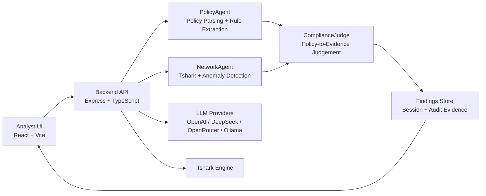

<p align="center">
  
</p>

<h2 align="center">Demo Video</h2>

<p align="center">
  <a href="https://github.com/abyasham/security-audit-compliance-agent-v.13/releases/download/saca13/saca13.mp4">
    
  </a>
</p>

<p align="center">
  
  
  
  
</p>

**SACA** (Security Audit Compliance Agent) is a next-generation network security auditing platform that combines packet-level evidence, policy-aware reasoning, and multi-agent LLM analysis to produce defensible compliance findings from pcap data.

---

## Quick Start (Docker)

```bash
cp .env.example .env.docker
# Add at least one cloud provider key in .env.docker:
#   OPENAI_API_KEY, DEEPSEEK_API_KEY, or OPENROUTER_API_KEY
docker compose --env-file .env.docker up --build
```

Open:

- **Frontend:** http://localhost:5173
- **Backend health:** http://localhost:3001/api/health

> **Note:** Without cloud API keys, only Ollama will be available as an LLM provider.

---

## Executive Summary

Modern network security teams still rely heavily on manual Wireshark triage, ad hoc scripts, and fragmented reporting workflows. SACA addresses this by providing a unified pipeline where analysts can:

- Upload a packet capture and a security policy document.
- Run an automated multi-agent analysis pipeline.
- Receive evidence-backed findings classified as **violated**, **compliant**, or **suspicious**.
- Interactively investigate and validate findings through a tool-assisted chat interface.

The design goal is **practical audit acceleration** — not black-box summarization, but transparent, evidence-grounded results.

---

## Positioning

SACA is inspired by strong agentic traffic-analysis patterns while focusing on **compliance judgment** and **policy-to-evidence mapping** as first-class outcomes.

Key differentiators:

- **Policy-agnostic** compliance evaluation from uploaded policy text (PDF, DOCX, JSON, YAML, TXT).
- Dedicated **ComplianceJudge** stage after network analysis.
- Findings structure designed for **audit defensibility** and **traceability**.
- Built-in detection coverage for common enterprise and IoT attack patterns.

---

## Core Capabilities

- **Multi-agent pipeline:** PolicyAgent, NetworkAgent, ComplianceJudge.
- **Evidence-driven chat** with a tool loop backed by `tshark` retrieval.
- **Detection coverage** includes:
  - DNS hijacking and spoofing.
  - DNS tunneling heuristics.
  - Session hijacking (token reuse across source IPs).
  - OS fingerprinting (SYN option signature diversity).
  - ARP spoofing, brute force, SYN scan, Mirai-like behavior.
- **UI triage support** with DNS-first findings sorting.
- **Local-first deployment** for controlled security environments.

---

## Architecture Overview

1. **Policy parsing and normalization** — extract structured rules from uploaded policy documents.
2. **Network traffic analysis** — run `tshark`-based anomaly detection on pcap data.
3. **Compliance judgment** — cross-reference policy rules against detected anomalies.
4. **Findings persistence and analyst review** — store results and enable interactive investigation.

### High-Level Components

| Layer | Technology |
|-------|-----------|
| Backend | Express.js + TypeScript agent orchestration |
| Frontend | React + Vite analyst workspace |
| Packet engine | tshark / Wireshark CLI |
| LLM providers | OpenAI, DeepSeek, OpenRouter, Ollama |



---

## Repository Layout

```
├── backend/          API, agents, and services (Express + TypeScript)
├── frontend/         Web application (React + Vite)
├── policy/           Sample policy artifacts for testing
├── scripts/          Start, stop, reset, and utility scripts
├── media/            Screenshots and demo assets
├── docker-compose.yml
└── package.json      Root monorepo scripts
```

---

## Prerequisites

- **Node.js** 20+
- **npm** 10+
- **tshark** (Wireshark CLI) — available on PATH or configured via `TSHARK_PATH` environment variable

---

## Local Development

### Install Dependencies

```bash
npm install
cd backend && npm install
cd ../frontend && npm install
cd ..
```

### Run the Application

```bash
npm run start:all
```

This starts both the backend (port 3001) and frontend (port 5173) concurrently.

### Stop the Application

```bash
npm run stop
```

### Endpoints

| Service | URL |
|---------|-----|
| Frontend | http://localhost:5173 |
| Backend API | http://localhost:3001 |
| Health Check | http://localhost:3001/api/health |

---

## Docker Deployment (Recommended for Demos)

SACA can run without a GPU by using cloud LLM providers (OpenAI, DeepSeek, OpenRouter).

1. Create a Docker environment file:

```bash
cp .env.example .env.docker
```

2. Add the provider API keys you plan to use.

3. Build and start containers:

```bash
docker compose --env-file .env.docker up --build
```

4. Stop containers:

```bash
docker compose down
```

> **Note:** If no cloud API keys are supplied, only Ollama will be available.

---

## Security & Secret Management

SACA includes built-in guardrails to prevent accidental secret exposure:

- **`.gitignore`** blocks `.env`, `.env.local`, `.env.docker`, and common key/certificate files.
- **Pre-commit secret scanner** blocks staged files matching sensitive patterns (API keys, tokens, private keys).

### Enable Git Hooks

```bash
npm run security:install-hooks
```

### Run Manual Staged Scan

```bash
npm run security:scan-staged
```

### Recommended Local Secret Files

| File | Purpose |
|------|---------|
| `backend/.env.local` | Backend runtime API keys |
| `.env.docker` | Docker Compose demo keys |

### Tracked Templates

- `backend/.env.example`
- `.env.example`

---

## Validation & Faithfulness

SACA v13 uses the **GT-01 through GT-13** benchmark scenarios to measure detection quality and explanation grounding.

### Evaluation Mechanism

- **Ground-truth anchor:** Known attack behavior from GT-01..GT-13 scenarios.
- **Output under test:** Findings, evidence packet numbers, reasoning text, and policy linkage.
- **RAGAS-style faithfulness focus:** Verify that model claims are supported by retrieved packet evidence and policy clauses — not hallucinated summaries.

### Interpretation

| Faithfulness | Meaning |
|-------------|---------|
| **High** | Finding reasoning is directly traceable to packet-level evidence and mapped policy text. |
| **Low** | Reasoning includes unsupported claims, weak evidence linkage, or policy mismatch. |

### Current Validation Emphasis

- **GT-07** — DNS hijacking / spoofing detection quality.
- **GT-10** — OS fingerprinting signal surfacing.
- **GT-13** — Session hijacking / token reuse visibility.

This GT + RAGAS-faithfulness workflow ensures SACA remains evidence-grounded as capabilities evolve.

---

## Status

This project is an actively evolving implementation of a practical, explainable network security auditing platform.

---

## Contributing

Contributions are welcome! Whether you're fixing bugs, improving detection coverage, adding new LLM provider support, or enhancing documentation — feel free to open issues and submit pull requests.

---

<p align="center">
  <strong>Made in the UK by OCB — 2026</strong>
</p>
